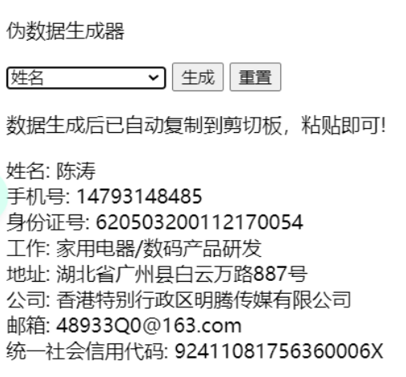
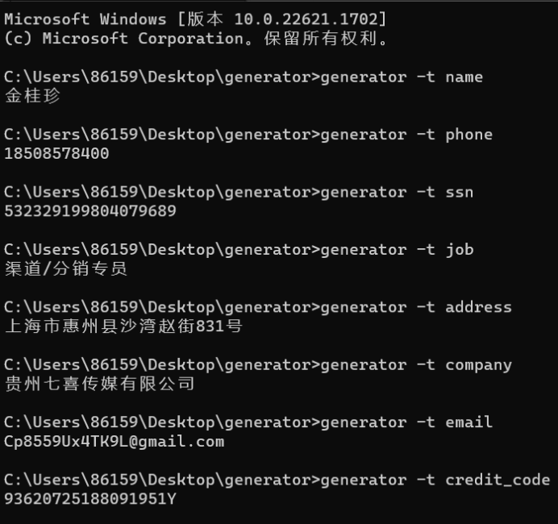

# 伪数据生成工具

伪数据生成工具,支持命令行和浏览器两种方式生成伪数据。可生成姓名、手机号、身份证号、统一社会信用代码等数据，数据生成后自动复制到剪切板。
该工具由python语言编写，使用了flask，click等第三方库。

**浏览器方式**



**命令行方式**



## 部署

1. 下载源码。确保本地已安装git，打开控制台使用`git clone https://github.com/3293406747/fake-data-generator.git` 命令下载源代码。
2. 安装依赖。确保本地已安装python，在控制台进入项目根目录，之后执行`pip install -r requirements.txt`。

## 使用方法

### 浏览器

1. 进入'web'目录找到'flask_app.py'文件并执行该文件。
2. 在浏览器中访问url`http://127.0.0.1:5000`。

### 命令行

1. 在命令行切换到项目根目录下的command目录。
2. 在命令行运行以下命令运行程序，如要生成姓名:
```shell
python __init__.py -t name
```

## 打包成可执行文件（.exe）

如果你想将该 Python 程序打包成 Windows 可执行文件，可以使用 PyInstaller 工具进行打包。
打包后的程序可以在 Windows 上运行，而无需安装 Python 环境。

1. 安装pyinstaller工具。在命令行中执行`pip install pyinstaller`命令以安装pyinstaller工具。
2. 执行打包命令。在命令行进入程序所在目录，执行`pyinstaller -D __init__.py`命令。
3. 添加资源文件。打包完成后在生成的'dist'目录'下找到\_\_init__'目录并进入，并将'data'目录复制到该目录中。
4. 运行可执行文件。在命令行切换到该目录，在命令行执行`__init__ -t name`命令，该命令用于生成姓名。

## 命令行命令说明

### 参数设置

- --target / -t: 要生成的数据，必填参数。

### 支持的参数

- name: 姓名
- phone: 手机号
- ssn: 身份证号
- job: 工作名称
- address: 地址
- company: 公司名称
- email: 邮箱
- credit_code: 统一社会信用代码

## 支持

如果你喜欢该项目可以在github进行star或分享。